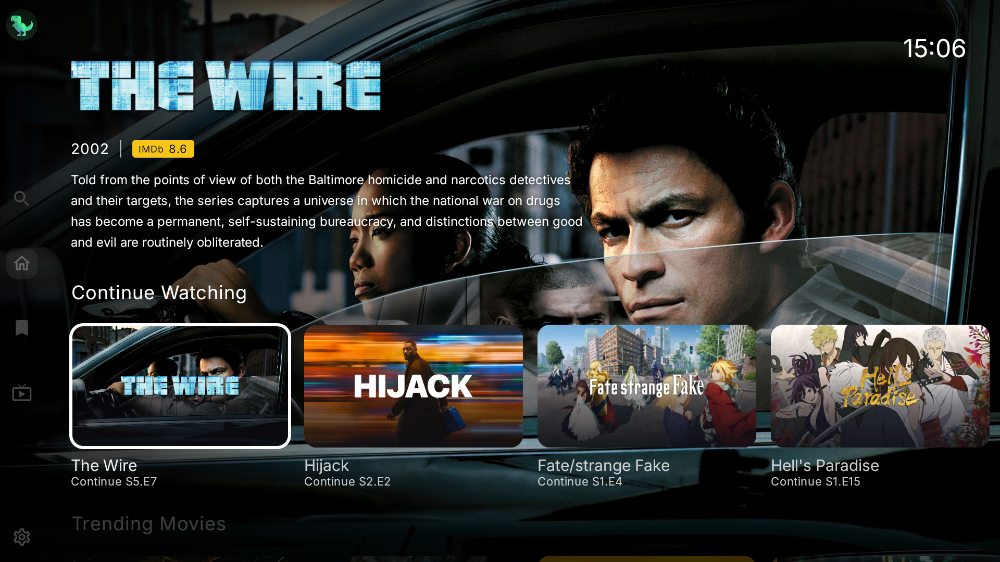
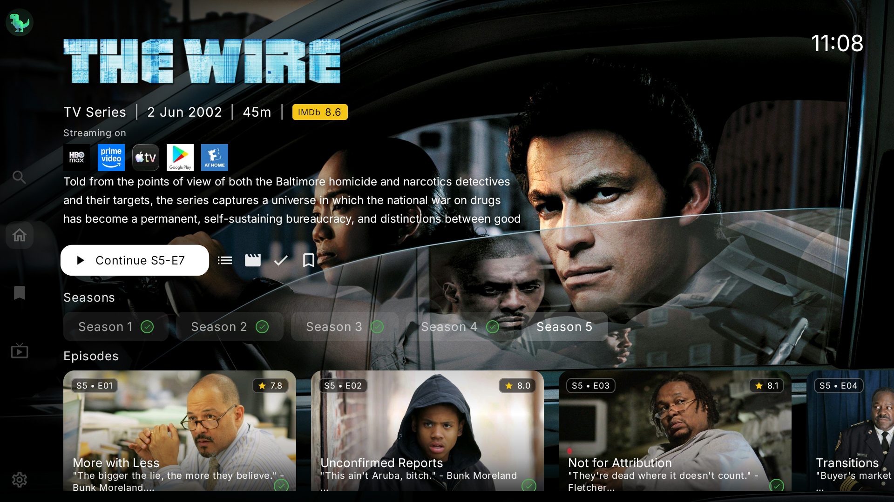
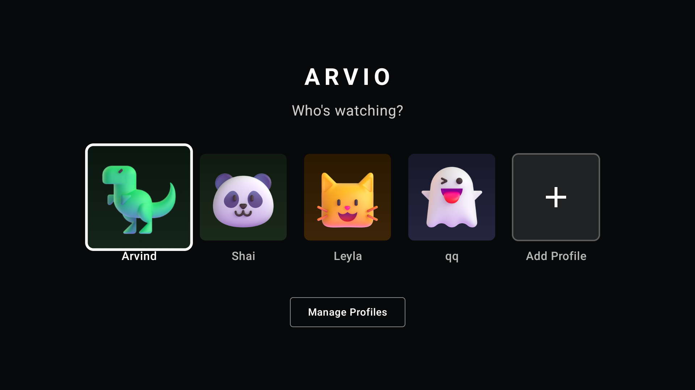
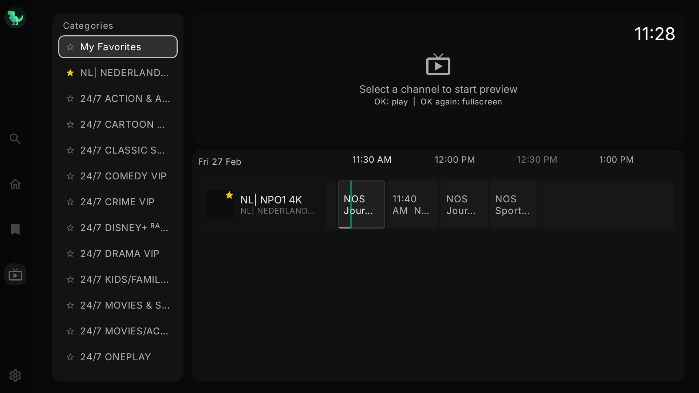

  

# ARVIO - Media Hub for Android TV

A media hub application for Android TV with a modern, beautiful interface. Browse your media library, discover content, and play videos from your configured sources.

## Features

- **Live TV (IPTV)** - M3U playlist support with group navigation and mini-player
- **Catalog Management** - Built-in + custom Trakt/MDBList catalogs with ordering controls
- **ARVIO Cloud (Optional)** - QR sign-in with cloud sync for profiles, addons, catalogs and IPTV config
- **Stremio Addon Support** - Connect your favorite addons
- **Media Browser** - Browse and discover content with TMDB metadata
- **Beautiful UI** - Modern horizontal row browsing optimized for D-pad/remote
- **Trakt.tv Integration** - Sync watch history across devices
- **Watchlist** - Save items to watch later
- **Multi-profile** - Multiple user profiles per account
- **Subtitle & Audio** - Multiple tracks with language selection
- **Continue Watching** - Resume from where you left off
- **Auto-play** - Next episode auto-play with countdown

## Player

Powered by **ExoPlayer (Media3)** with **FFmpeg extension** for broad codec support.

**Video:** H.264, H.265/HEVC, VP9, AV1, Dolby Vision
**Audio:** AAC, AC3, EAC3, DTS, DTS-HD, TrueHD, Dolby Atmos
**Containers:** MKV, MP4, WebM, HLS, DASH
**Quality:** Up to 4K HDR

Note: If you mean **DTX**, ARVIO supports **DTS-family audio formats** (DTS/DTS-HD). Actual passthrough/decoding still depends on device + Android audio pipeline.

## Screenshots

| Home | Details |
|------|---------|
|  |  |

| Player | Profiles |
|--------|----------|
|  |  |

| Live TV | Catalogs (Trakt + MDBList) |
|---------|------------------------------|
|  |  |

## Download

### Install from Play Store

### Direct Download
[Download APK](https://github.com/ProdigyV21/ARVIO/releases/latest) from the Releases page.

## Star History

  <a href="https://www.star-history.com/#ProdigyV21/ARVIO&Date">
    <picture>
      <source
        media="(prefers-color-scheme: dark)"
        srcset="https://api.star-history.com/svg?repos=ProdigyV21/ARVIO&type=Date&theme=dark"
      />
      <source
        media="(prefers-color-scheme: light)"
        srcset="https://api.star-history.com/svg?repos=ProdigyV21/ARVIO&type=Date"
      />
      
    </picture>
  </a>

## Support

If ARVIO helps you, donations are always appreciated:
- Ko-fi: https://ko-fi.com/arvio

Join the community:
- Discord: https://discord.gg/bGBBGKFZVh

## License

This project is licensed under the Apache License 2.0 - see the [LICENSE](LICENSE) file for details.

## Privacy Policy

See [PRIVACY.md](PRIVACY.md) for our privacy policy.

## AI Disclosure

This application was developed with significant assistance from AI (Claude by Anthropic). If you have concerns about using AI-generated software, please do not use this application.

## Disclaimer

ARVIO is a media hub application that does not host, store, or distribute any content. It is a player interface that connects to user-configured Stremio addons and external services. Users are solely responsible for the addons they install and the content they access. The developers are not responsible for any misuse of this application.
